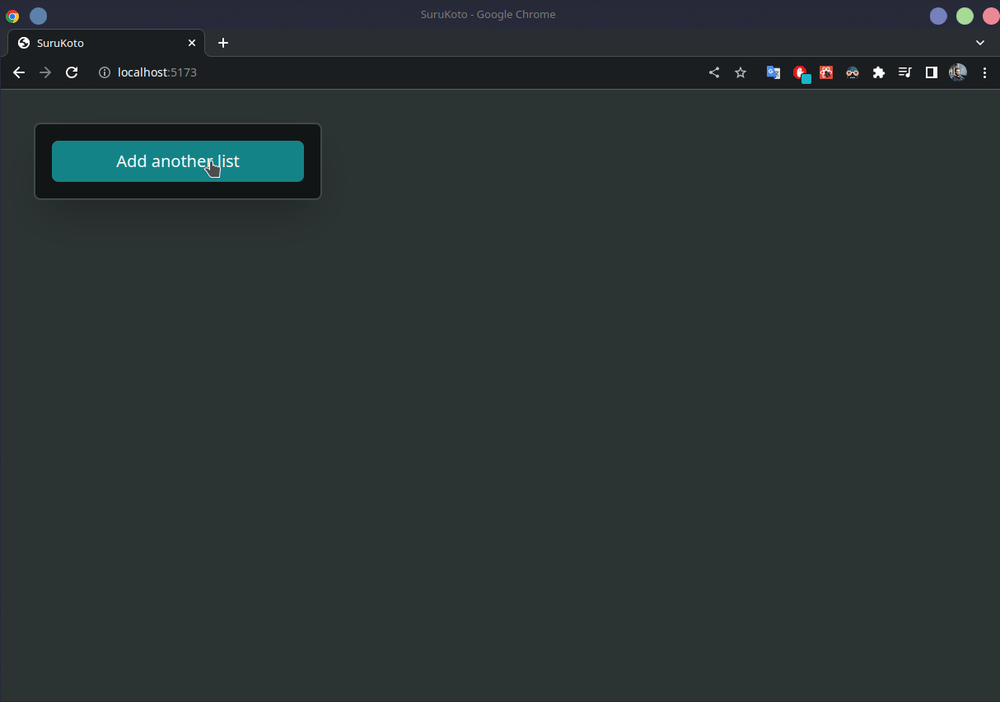

# Rika

Rika is a project tracking tool has kanban, to-do list and other toolchain like JIRA, Trello etc.

It aims to create a open-source alternative to project tracking applications (mostly JIRA).

## Screenshots

